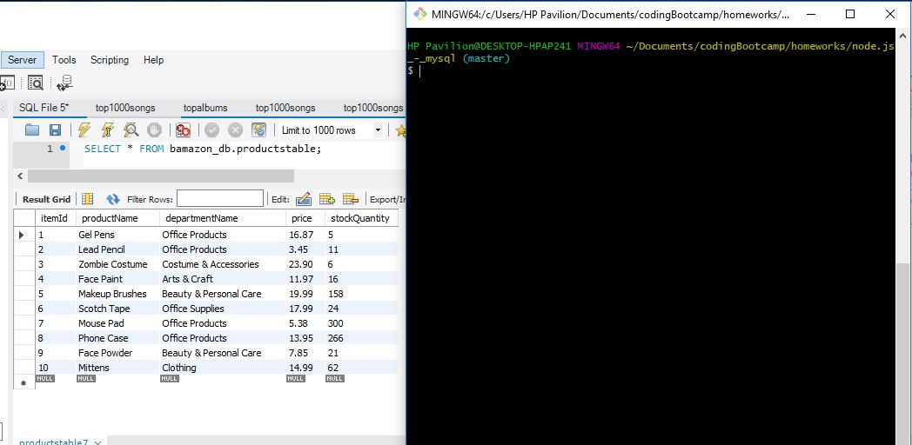
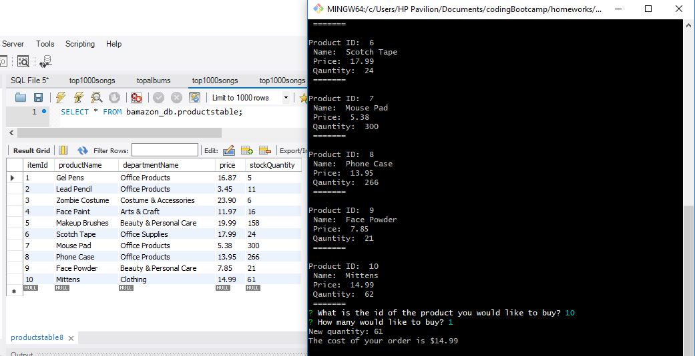

# Node.js & MySQL

This app is a storefront that allows the user to shop - similar to Amazon's storefront.  Instead of shopping through a web browser, the user uses the command-line on terminal to do their shopping. 

First off, on the terminal, navigate to the correct folder where the file is stored in. 
Then enter this command on the command-line:
`node bamazonCustomer.js`  

A list of the store’s products will show up.  Here, the user can view the product information such as product id, product name, product price, and product available quantity.  In this image, the product id #10 starts off at quantity of 62.
  

Then the terminal will ask the user what product they want by id and how many. The user can then input the id and quantity they want on the command-line.  

The user purchases one item from product id #10 and the remaining quantity updates to 61.
 

### Tools Used 
The tools in this application are node.js and mySQL.  Node.js was used to design the storefront user interface while mySQL was used as the database and to stored information.  When a user purchased something through the terminal, mySQL updated and showed the remaining quantity.  

